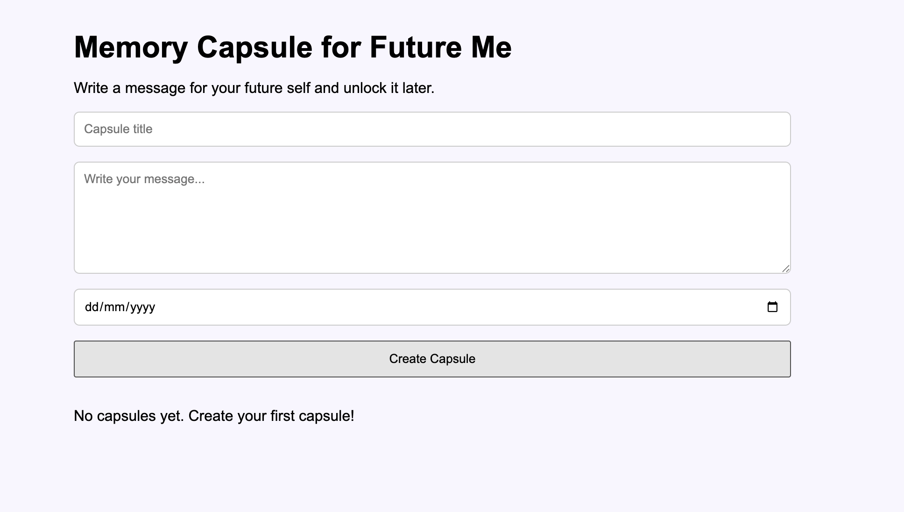

# Memory Capsules for Future Me

A React-based web application that allows users to create digital memory capsules and unlock them on a future date. Users can write messages to their future selves, set an unlock date, and revisit their memories when the specified date arrives.

---

## 📖 About the Project

Most messaging and note-taking applications focus on immediate access to information. **Memory Capsules for Future Me** takes a different approach by allowing users to write messages that remain locked until a chosen future date.

The project was developed to explore React fundamentals, component-based architecture, state management, browser storage, and date-based logic while building an application that promotes self-reflection and future planning.

This application acts as a digital time capsule where users can preserve thoughts, goals, memories, and personal milestones for their future selves.

---

## 🎯 Project Objectives

The primary objectives of this project were:

* Learn and apply React fundamentals in a real-world project
* Practice component-based architecture
* Implement state management using React Hooks
* Work with browser Local Storage
* Handle date-based access control logic
* Improve frontend design and user experience skills
* Build a meaningful application with practical use cases

---

## ✨ Features

### Create Memory Capsules

Users can create personal memory capsules by providing:

* Title
* Message
* Future unlock date

### Time-Locked Access

Capsules remain locked until the specified unlock date arrives.

### Automatic Unlocking

Messages become visible automatically when the unlock date is reached.

### Delete Capsules

Users can remove unwanted capsules at any time.

### Local Storage Integration

All capsules are stored in browser Local Storage, ensuring data remains available after page refreshes.

### Form Validation

Prevents users from creating incomplete or invalid capsules.

### Responsive User Interface

Designed to work across desktops, tablets, and mobile devices.

### Component-Based Architecture

Application structure follows React best practices using reusable components.

---

## 💡 Why This Project?

The idea behind Memory Capsules is to create a digital time capsule experience.

Users can:

* Write goals for their future selves
* Save meaningful memories
* Store motivational messages
* Record personal achievements
* Reflect on growth over time
* Capture thoughts that can be revisited later

Unlike traditional note-taking applications, Memory Capsules introduces time-based accessibility, making interactions more engaging and meaningful.

---

## 🛠️ Tech Stack

### Frontend

* React.js
* JavaScript (ES6+)
* HTML5
* CSS3

### Development Tools

* Vite
* Git
* GitHub
* VS Code

---

## 📁 Project Structure

```text
src/
├── assets/
│   └── Memory_Capsules.png
│
├── components/
│   ├── CreateCapsule.jsx
│   ├── CapsuleCard.jsx
│   └── CapsuleList.jsx
│
├── pages/
│   └── Home.jsx
│
├── App.jsx
├── App.css
├── index.css
└── main.jsx
```

---

## ⚙️ How It Works

1. Create a new memory capsule.
2. Enter a title and personal message.
3. Select a future unlock date.
4. Save the capsule.
5. The capsule remains locked until the selected date.
6. Once the unlock date arrives, the message automatically becomes visible.
7. Users can delete capsules whenever desired.

---

## 🧠 Key Concepts Implemented

### React Fundamentals

* Functional Components
* Component Reusability
* Props
* useState Hook
* Event Handling

### JavaScript Concepts

* Arrays and Objects
* Date Manipulation
* Conditional Logic
* Dynamic Rendering
* Array Mapping

### Frontend Development

* Responsive Design
* Form Handling
* User Experience Design
* State Management

### Browser APIs

* Local Storage

---

## 🚧 Challenges Faced

### 1. Date-Based Access Control

One of the biggest challenges was implementing logic that determines whether a memory capsule should remain locked or become visible.

This required comparing the current date with the user-selected unlock date while ensuring consistent behavior across sessions.

### 2. Conditional Rendering

The application needed to display different content depending on whether a capsule was locked or unlocked.

React's conditional rendering was used to dynamically update the user interface.

### 3. Persistent Data Storage

Without Local Storage, all capsules would disappear after refreshing the page.

Implementing browser-based storage allowed capsules to remain available even after closing and reopening the application.

### 4. Form Validation

Users could potentially create empty or invalid capsules.

Validation logic was added to ensure meaningful and complete submissions.

### 5. Component Communication

Managing data flow between components while maintaining a clean architecture helped improve understanding of React props and state management.

---

## 🧩 Skills Demonstrated

* React Development
* Component-Based Architecture
* State Management with Hooks
* Local Storage Integration
* Date Manipulation
* Conditional Rendering
* Form Validation
* Responsive UI Design
* Problem Solving
* Git Version Control
* Frontend Development Best Practices

---

## 📸 Screenshot

```md

```

---

## 📚 Learning Outcomes

This project strengthened my understanding of:

* React component architecture
* State management using React Hooks
* JavaScript date handling
* Conditional rendering
* Dynamic UI updates
* Browser Local Storage
* Frontend project organization
* Responsive design principles
* Git and GitHub workflows

---

## 🚀 Installation

Clone the repository:

```bash
git clone https://github.com/DDas12345/Memory_Capsules.git
```

Navigate to the project folder:

```bash
cd Memory_Capsules
```

Install dependencies:

```bash
npm install
```

Run the development server:

```bash
npm run dev
```

Open your browser and visit:

```text
http://localhost:5173
```

---

## 🔮 Future Enhancements

Planned improvements include:

* Countdown timer until unlock date
* Edit existing capsules
* Search and filter functionality
* Dark mode support
* Capsule categories and tags
* User authentication
* Firebase integration
* MongoDB database support
* Cloud synchronization
* Email reminders before unlock
* Image and file attachments
* Capsule sharing options

---

## 📄 Resume Highlights

* Developed a React-based digital memory capsule application with time-locked message functionality.
* Implemented date-based access control using JavaScript Date APIs.
* Built reusable React components following a modular architecture.
* Managed application state using React Hooks.
* Integrated Local Storage for persistent client-side data storage.
* Applied form validation and conditional rendering techniques.
* Utilized Git and GitHub for version control and project management.

---

## 🌟 Project Significance

This project demonstrates how frontend technologies can be used to create meaningful user experiences beyond traditional CRUD applications.

By combining React, JavaScript date handling, and browser storage, Memory Capsules offers a unique approach to preserving thoughts and memories for the future.

---

## 👩‍💻 Author

**Debanshika Das**

Built as a React frontend project to explore time-based user interactions, state management, Local Storage integration, and modern component-driven web development.

Repo: https://github.com/DDas12345/Memory_Capsules.git
Deploy: https://fanciful-madeleine-dc223b.netlify.app/

---

## ⭐ Support

If you found this project interesting, consider giving it a star on GitHub and sharing your feedback.